# A Intellij plugin designed for better coding with Java.

## Features

Following are supported:

### Create an Info class (here means view model) based on a DTO class, the generated Info class depends on the DTO class's name and fields.  

Right-click on a package folder in the "Project" view, and then click "New" and "Info Class" to use it.  

Create a new Info class.
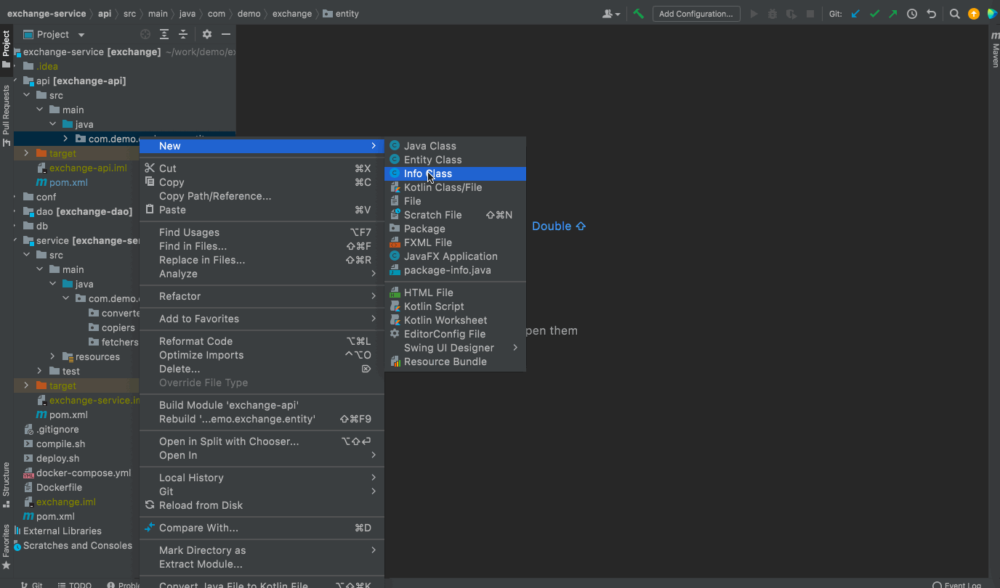

### Import fields into an Info class from a DTO class, including their types, names and documents.  

Right-click in an Info class, and then click "Import Fields from DTO" context menu to use it.  

Import fields from DTO class to Info class.
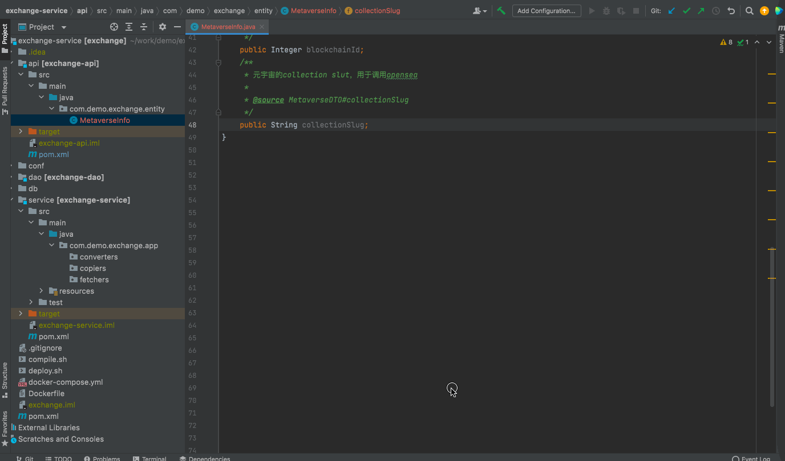

Create extra fields in Info class.
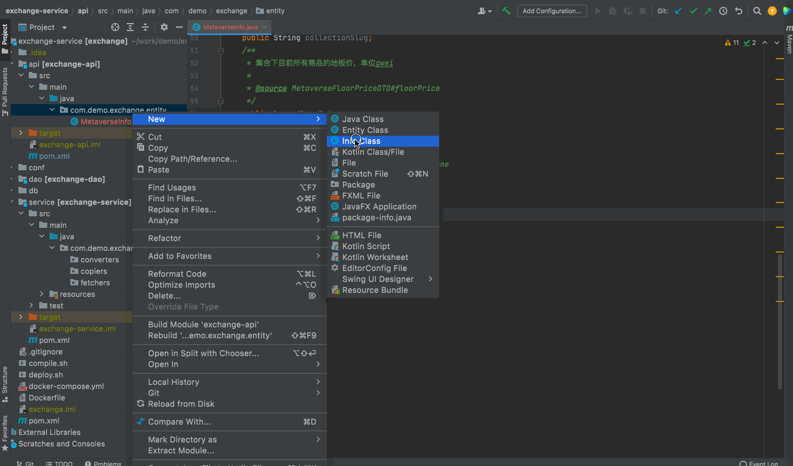

### Create a converter class used to convert a DTO to an Info object, or a list of DTOs to a list of Info objects, DTO or Info class joining also supported.  

Right-click on a package folder (which must contains a subfolder named "converter" or "converters"), and then click "New" and "Converter Class".  
Then a config dialog will be shown to let you specify the Info class to convert to, the DTO class to convert from and all related joins.  
This function use the SQL model to express the internal logic of a multi table related query, which will influence the generated code entirely.  
Note, this command will also generate related fetchers (used to query db), and copiers (used to copy fields from DTO to Info class).  
We hope you are familiar with this design.

Create a converter.

### Generate properties assigning statements between two variables in a code block

Write an assignment expression and open the intention context menu, then click "Property Assign" to use it.

Assign properties.
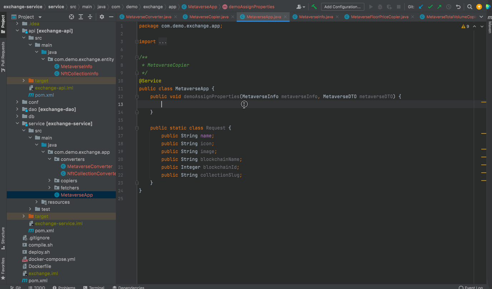

Assign from this keyword.
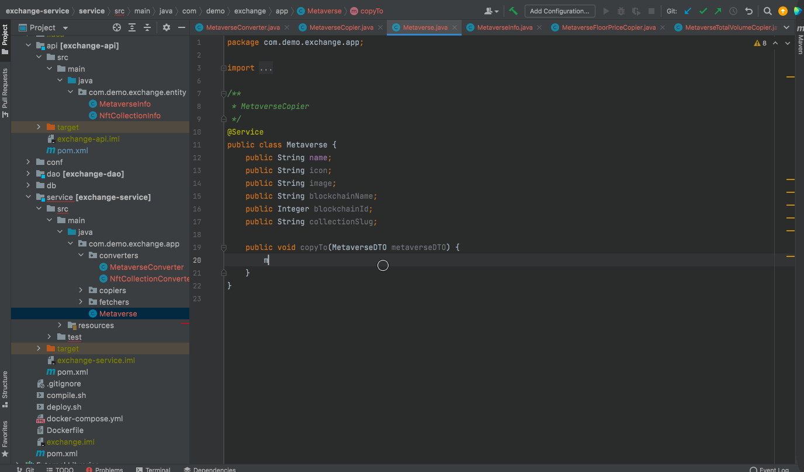

Assign to this keyword.
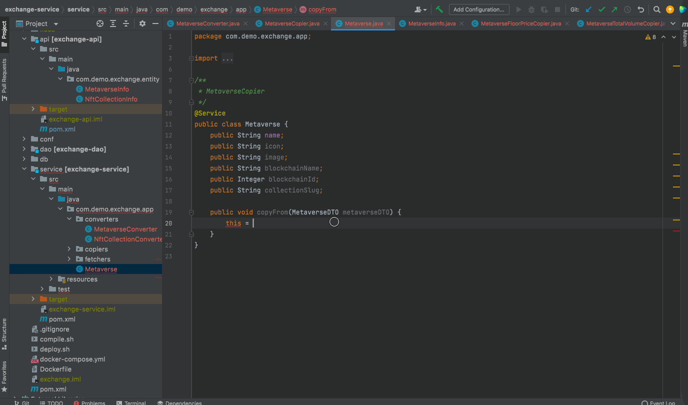

Assign fields from getters.
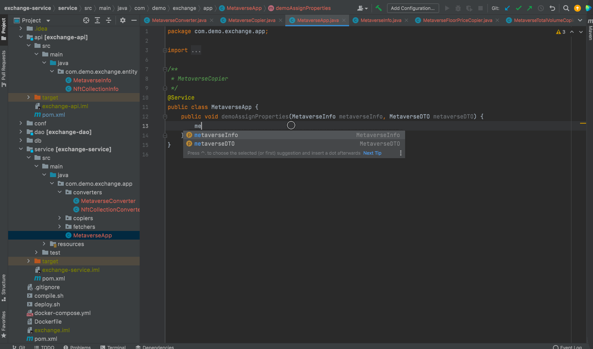

Assign fields by setters.
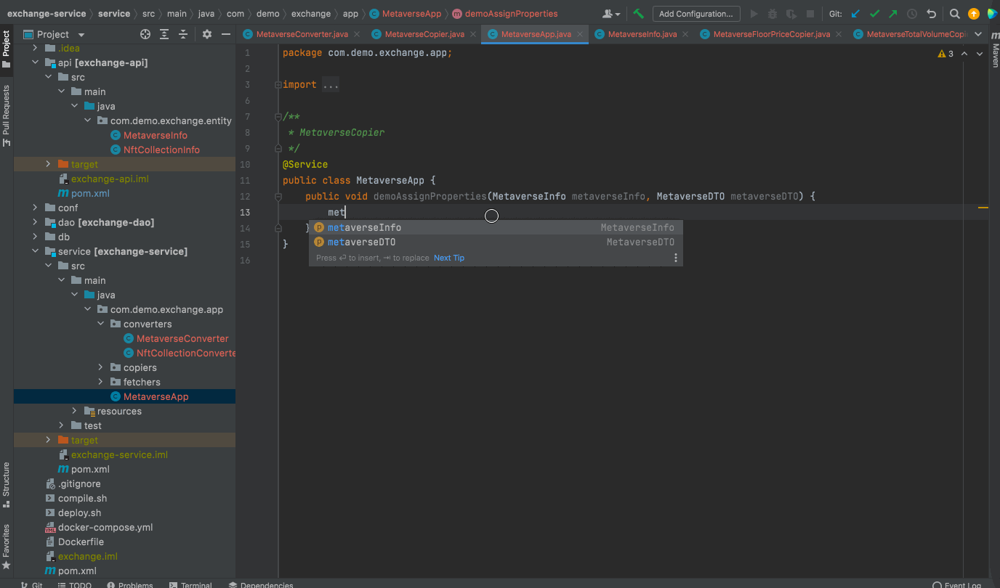

### Create an Entity class (the same meaning in DDD) based on a DTO class, according to its fields (name, type and comments) and name.  

Right-click on a package folder, and then click "New" and "Entity class" to use it.

Create entity class.
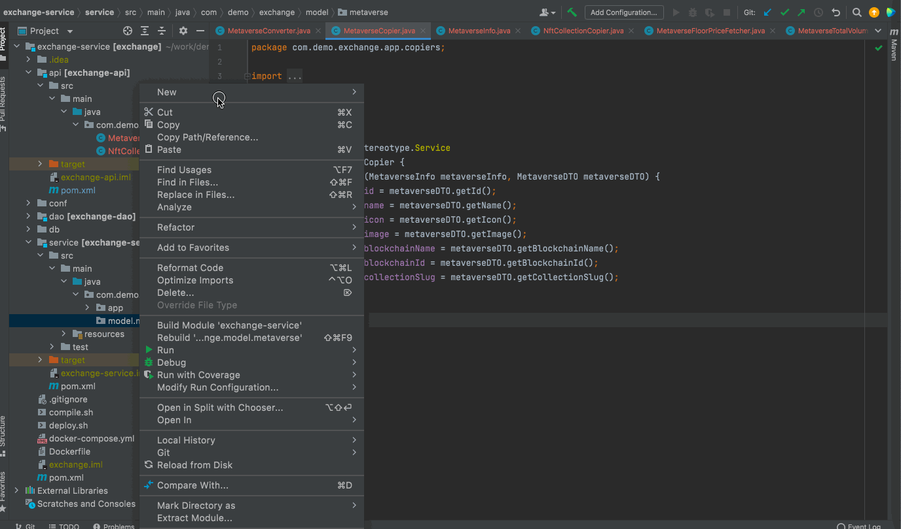

### Add repository support for an Entity class, which means to generate a set of classes, fields and methods to support the entity's basic function.  

This including converting a DTO to an Entity, tracking all restored or new-created entities, restore an entity from DB, etc.  
Right-click an entity class, and then click "Add To Repository" context menu to use it.

Add repository support for entity.
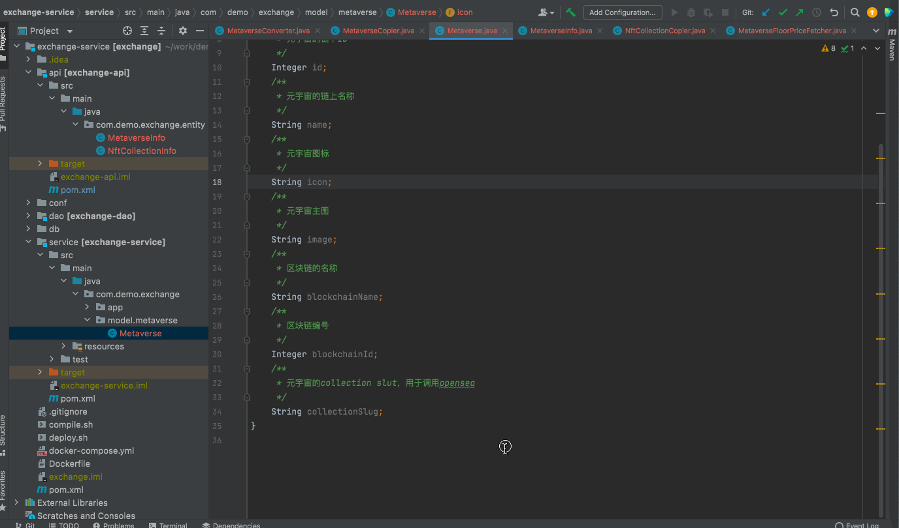

### Other useful completion contributors.

Some quick way to add fields / methods in a repository class.
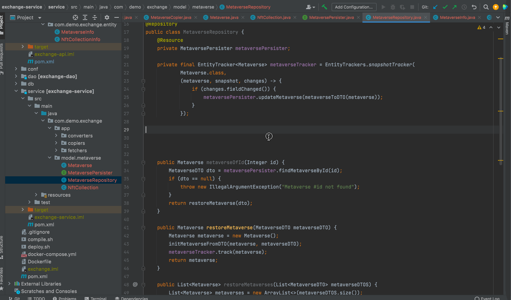

## Settings

Following can be configured per project:

* Logical delete field names
* Info field template
* Info class template
* Entity tracker and trackers class
* Entity not found code template

For example
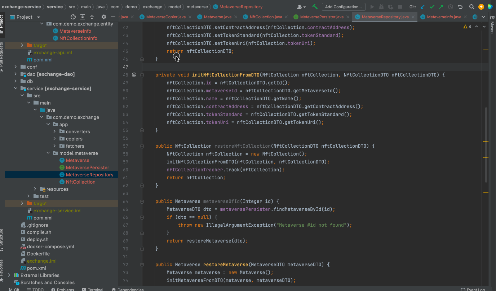
